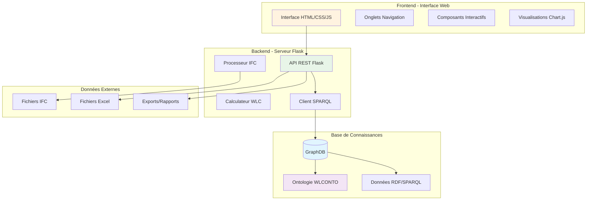
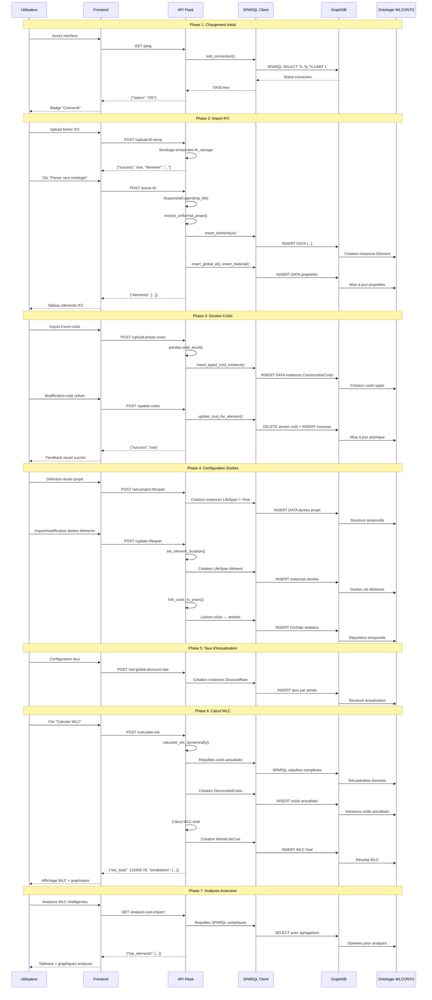
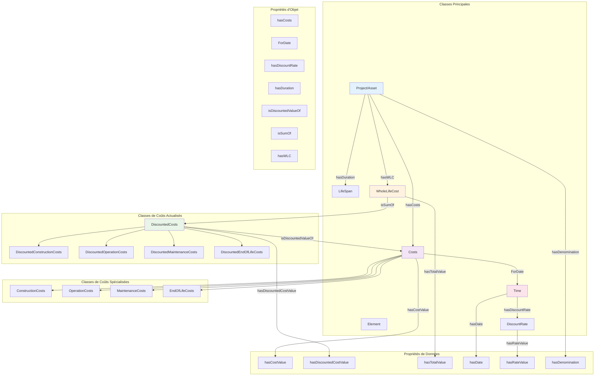
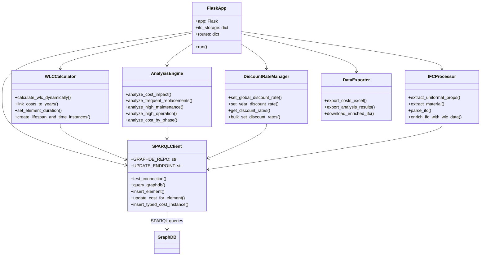
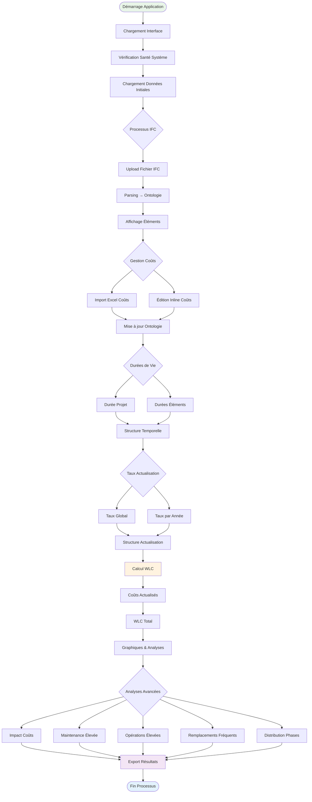

# Architecture Complète de la Plateforme WLC

## Vue d'Ensemble

La Plateforme WLC (Whole Life Cost) est une application web full-stack qui utilise une ontologie RDF (WLCONTO) pour gérer et analyser les coûts globaux des projets de construction selon la norme ISO 15686-5.

## Architecture Générale



## Diagramme de Séquence - Processus Principal WLC



## Architecture de l'Ontologie WLCONTO



## Diagramme de Classes - Structure Backend



## Diagramme de Composants - Frontend

```mermaid
graph TB
    subgraph "Frontend Architecture"
        subgraph "Interface Layers"
            HTML[index.html]
            CSS[main.css]
            JS[main.js]
        end
        
        subgraph "JavaScript Modules"
            MAIN[Application Principale]
            NOTIF[notifications.js]
            UPLOAD[fileUpload.js]
            TABLE[dataTable.js]
        end
        
        subgraph "UI Components"
            NAV[Navigation Tabs]
            IFC_TAB[Onglet IFC]
            ELEM_TAB[Onglet Éléments]
            COST_TAB[Onglet Coûts]
            LIFE_TAB[Onglet Durées]
            SUMM_TAB[Onglet Synthèse]
            ANAL_TAB[Onglet Analyses]
        end
        
        subgraph "Data Management"
            STATE[appState]
            ELEMENTS[elements[]]
            DISCOUNTS[discountRates[]]
            CHARTS[Chart.js Instances]
        end
        
        subgraph "API Communication"
            FETCH[Fetch API]
            REST[REST Endpoints]
            JSON[JSON Responses]
        end
    end
    
    HTML --> CSS
    HTML --> JS
    JS --> MAIN
    MAIN --> NOTIF
    MAIN --> UPLOAD
    MAIN --> TABLE
    
    NAV --> IFC_TAB
    NAV --> ELEM_TAB
    NAV --> COST_TAB
    NAV --> LIFE_TAB
    NAV --> SUMM_TAB
    NAV --> ANAL_TAB
    
    MAIN --> STATE
    STATE --> ELEMENTS
    STATE --> DISCOUNTS
    MAIN --> CHARTS
    
    MAIN --> FETCH
    FETCH --> REST
    REST --> JSON
    
    style MAIN fill:#e3f2fd
    style STATE fill:#f3e5f5
    style REST fill:#e8f5e8
```

## Flux de Données Principal



## Modèle de Données RDF - Instances Types

### Exemple d'Instance Complète dans l'Ontologie

```turtle
# Élément IFC
<http://example.com/ifc#0M6O00Hb9CnBJN1ZE6l$Yl> a wlc:Element ;
    wlc:hasGlobalId "0M6O00Hb9CnBJN1ZE6l$Yl" ;
    wlc:hasDenomination "Mur porteur béton" ;
    wlc:hasUniformatCode "B2010" ;
    wlc:hasUniformatDescription "Bearing Walls" ;
    wlc:hasIfcMaterial "Concrete" ;
    wlc:hasDuration <http://example.com/project/lifespan/element_50years> ;
    wlc:hasCost <http://example.com/ifc#0M6O00Hb9CnBJN1ZE6l$Yl/cost/constructioncosts_abc123> ,
                <http://example.com/ifc#0M6O00Hb9CnBJN1ZE6l$Yl/cost/maintenancecosts_def456> ,
                <http://example.com/ifc#0M6O00Hb9CnBJN1ZE6l$Yl/cost/endoflifecosts_ghi789> .

# Coût de Construction
<http://example.com/ifc#0M6O00Hb9CnBJN1ZE6l$Yl/cost/constructioncosts_abc123> 
    a wlc:ConstructionCosts, wlc:Costs ;
    wlc:hasCostValue "15000.0"^^xsd:double ;
    wlc:appliesTo <http://example.com/ifc#0M6O00Hb9CnBJN1ZE6l$Yl> ;
    wlc:ForDate <http://example.com/project/lifespan/Year0> .

# Coût de Maintenance (répétition tous les 50 ans)
<http://example.com/ifc#0M6O00Hb9CnBJN1ZE6l$Yl/cost/maintenancecosts_def456> 
    a wlc:MaintenanceCosts, wlc:Costs ;
    wlc:hasCostValue "3000.0"^^xsd:double ;
    wlc:appliesTo <http://example.com/ifc#0M6O00Hb9CnBJN1ZE6l$Yl> ;
    wlc:ForDate <http://example.com/project/lifespan/Year50> .

# Taux d'Actualisation Année 50
<http://example.com/project/discountrate/Year50> a wlc:DiscountRate ;
    wlc:hasRateValue "0.04"^^xsd:double ;
    wlc:ForYear <http://example.com/project/lifespan/Year50> .

# Coût Actualisé Résultant
<http://example.com/project/discounted/maintenancecosts_def456_discounted> 
    a wlc:DiscountedMaintenanceCosts, wlc:DiscountedCosts ;
    wlc:hasDiscountedCostValue "421.93"^^xsd:double ;
    wlc:isDiscountedValueOf <http://example.com/ifc#0M6O00Hb9CnBJN1ZE6l$Yl/cost/maintenancecosts_def456> ;
    wlc:ForDate <http://example.com/project/lifespan/Year50> .

# WLC Final du Projet
<http://example.com/project/wlc/final> a wlc:WholeLifeCost ;
    wlc:hasTotalValue "8547231.45"^^xsd:double ;
    wlc:isSumOf <http://example.com/project/discounted/constructioncosts_sum> ,
                <http://example.com/project/discounted/operationcosts_sum> ,
                <http://example.com/project/discounted/maintenancecosts_sum> ,
                <http://example.com/project/discounted/endoflifecosts_sum> .
```

## Requêtes SPARQL Clés

### 1. Requête WLC Total
```sparql
PREFIX wlc: <http://www.semanticweb.org/adamy/ontologies/2025/WLCONTO#>

SELECT (SUM(?discountedValue) AS ?wlcTotal) WHERE {
    ?discountedCost a wlc:DiscountedCosts ;
                   wlc:hasDiscountedCostValue ?discountedValue .
}
```

### 2. Analyse Impact Coûts par Élément
```sparql
PREFIX wlc: <http://www.semanticweb.org/adamy/ontologies/2025/WLCONTO#>

SELECT ?element ?denomination ?uniformat 
       (SUM(?constructionCost) AS ?totalConstruction)
       (SUM(?operationCost) AS ?totalOperation)
       (SUM(?maintenanceCost) AS ?totalMaintenance)
       (SUM(?endOfLifeCost) AS ?totalEndOfLife)
       ((?totalConstruction + ?totalOperation + ?totalMaintenance + ?totalEndOfLife) AS ?totalCost)
WHERE {
    ?element a wlc:Element ;
             wlc:hasDenomination ?denomination ;
             wlc:hasUniformatCode ?uniformat .
    
    OPTIONAL {
        ?element wlc:hasCost ?cc .
        ?cc a wlc:ConstructionCosts ;
            wlc:hasCostValue ?constructionCost .
    }
    
    OPTIONAL {
        ?element wlc:hasCost ?oc .
        ?oc a wlc:OperationCosts ;
            wlc:hasCostValue ?operationCost .
    }
    
    OPTIONAL {
        ?element wlc:hasCost ?mc .
        ?mc a wlc:MaintenanceCosts ;
            wlc:hasCostValue ?maintenanceCost .
    }
    
    OPTIONAL {
        ?element wlc:hasCost ?eol .
        ?eol a wlc:EndOfLifeCosts ;
            wlc:hasCostValue ?endOfLifeCost .
    }
}
GROUP BY ?element ?denomination ?uniformat
ORDER BY DESC(?totalCost)
LIMIT 20
```

### 3. Éléments avec Remplacements Fréquents
```sparql
PREFIX wlc: <http://www.semanticweb.org/adamy/ontologies/2025/WLCONTO#>

SELECT ?element ?denomination ?uniformat ?lifespanYears 
       (COUNT(?maintenanceCost) AS ?maintenanceCount)
       (SUM(?maintenanceCost) AS ?totalMaintenance)
WHERE {
    ?element a wlc:Element ;
             wlc:hasDenomination ?denomination ;
             wlc:hasUniformatCode ?uniformat ;
             wlc:hasDuration ?lifespan .
    
    ?lifespan wlc:hasLifeSpanValue ?lifespanYears .
    
    ?element wlc:hasCost ?mc .
    ?mc a wlc:MaintenanceCosts ;
        wlc:hasCostValue ?maintenanceCost .
    
    FILTER(?lifespanYears <= 25)
}
GROUP BY ?element ?denomination ?uniformat ?lifespanYears
HAVING (?maintenanceCount > 0)
ORDER BY ?lifespanYears DESC(?totalMaintenance)
```

## Points d'Extension et Évolutivité

### 1. Règles SWRL Potentielles
- Calcul automatique de coûts actualisés
- Validation de cohérence des données
- Inférence de durées de vie selon matériaux

### 2. Nouvelles Analyses
- Optimisation temporelle des maintenances
- Analyse de sensibilité aux taux d'actualisation
- Comparaisons de scénarios

### 3. Intégrations Futures
- BIM 360 / Autodesk Construction Cloud
- Bases de données de coûts nationales
- Outils de simulation énergétique

### 4. Améliorer Performances
- Cache Redis pour requêtes fréquentes
- Indexation GraphDB optimisée
- Pagination des résultats volumineux

## Conclusion

Cette architecture permet une gestion complète et sémantique du WLC en s'appuyant sur une ontologie formelle. La séparation claire entre interface, logique métier et base de connaissances facilite la maintenance et l'évolutivité du système. 