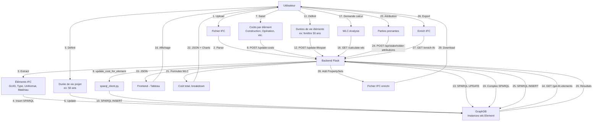

# SYNTHÈSE COMPLÈTE - PROJET PLATEFORME WLC

> **Document de référence** pour comprendre intégralement le projet  
> Date: 24 novembre 2024  
> Contexte: Après débogage intensif et apprentissage des erreurs

---

## TABLE DES MATIÈRES

1. [Vue d'ensemble](#vue-densemble)
2. [Architecture technique](#architecture-technique)
3. [Modèle de données ontologique](#modèle-de-données-ontologique)
4. [Logique métier WLC](#logique-métier-wlc)
5. [Workflow complet](#workflow-complet)
6. [Points critiques et pièges](#points-critiques-et-pièges)
7. [Roadmap future](#roadmap-future)

---

## VUE D'ENSEMBLE

### Objectif du projet
Plateforme web pour calculer le **Whole Life Cost (WLC)** d'un bâtiment selon la norme ISO 15686-5:
- Import de fichiers IFC (modèles BIM)
- Saisie et gestion des coûts par phase (Construction, Opération, Maintenance, Fin de vie)
- Calcul du coût global sur la durée de vie du projet
- Attribution des coûts aux parties prenantes
- Export des résultats enrichis dans IFC

### Utilisateurs cibles
- Architectes et ingénieurs BIM
- Gestionnaires de patrimoine immobilier
- Économistes de la construction
- Chercheurs en coût du cycle de vie

---

## ARCHITECTURE TECHNIQUE

### Stack complet

```
┌─────────────────────────────────────────────────────┐
│                  NAVIGATEUR WEB                     │
│  ┌──────────────────────────────────────────────┐  │
│  │  HTML (Bootstrap 5) + JavaScript (Vanilla)    │  │
│  │  - Tableau interactif (édition inline)        │  │
│  │  - Visualisations (Chart.js)                  │  │
│  │  - Imports/Exports fichiers                   │  │
│  └──────────────────┬───────────────────────────┘  │
└─────────────────────┼───────────────────────────────┘
                      │ HTTP / REST API
                      │ JSON
┌─────────────────────▼───────────────────────────────┐
│           BACKEND PYTHON (Flask)                    │
│  ┌──────────────────────────────────────────────┐  │
│  │ app.py (4472 lignes)                         │  │
│  │  - Routes API (~50 endpoints)                │  │
│  │  - Parsing IFC (IfcOpenShell)                │  │
│  │  - Calculs WLC (formules ISO 15686-5)        │  │
│  │  - Export enrichi IFC                        │  │
│  └──────────────────┬───────────────────────────┘  │
│  ┌──────────────────▼───────────────────────────┐  │
│  │ sparql_client.py (532 lignes)                │  │
│  │  - CRUD pour GraphDB                         │  │
│  │  - Requêtes SPARQL complexes                 │  │
│  │  - Gestion des instances                     │  │
│  └──────────────────┬───────────────────────────┘  │
└─────────────────────┼───────────────────────────────┘
                      │ SPARQL Protocol
                      │ HTTP POST
┌─────────────────────▼───────────────────────────────┐
│           GRAPHDB (Ontotext)                        │
│  Repository: wlconto                                │
│  ┌──────────────────────────────────────────────┐  │
│  │  WLCONTO.ttl (Ontologie principale)          │  │
│  │  - Classes: Element, Costs, Stakeholder...   │  │
│  │  - Propriétés: hasCost, hasDuration...       │  │
│  │  - Instances: éléments IFC + coûts           │  │
│  └──────────────────────────────────────────────┘  │
│  ┌──────────────────────────────────────────────┐  │
│  │  ifcowl.ttl (Mapping IFC-OWL)                │  │
│  └──────────────────────────────────────────────┘  │
└─────────────────────────────────────────────────────┘
```

### Technologies utilisées

| Composant | Technologie | Version | Rôle |
|-----------|-------------|---------|------|
| Backend Framework | Flask | 2.x | Serveur web, API REST |
| IFC Parser | IfcOpenShell | 0.8.x | Lecture/écriture fichiers IFC |
| Base de données | GraphDB Free | 10.x | Stockage RDF/SPARQL |
| Ontologie | OWL 2 | - | Modélisation sémantique |
| Frontend UI | Bootstrap | 5.3.2 | Interface responsive |
| Graphiques | Chart.js | 3.9.1 | Visualisations |
| Diagrammes | Mermaid.js | 10.6.1 | UML/flowcharts |

### Structure des fichiers

```
Plateforme/
├── Backend/
│   ├── app.py                    # ★ Application Flask principale
│   ├── sparql_client.py          # ★ Client GraphDB
│   ├── comparison_routes.py      # Routes comparaison scénarios
│   ├── config/
│   │   └── config.py             # Configuration GraphDB
│   ├── requirements.txt          # Dépendances Python
│   └── venv/                     # Environnement virtuel
│
├── Frontend/
│   ├── index.html                # ★ Interface principale
│   ├── assets/
│   │   ├── css/
│   │   │   └── main.css          # Styles personnalisés
│   │   └── js/
│   │       └── main.js           # ★ Logique frontend (6361 lignes)
│   └── package.json              # Métadonnées
│
├── Ontology/
│   ├── WLCONTO.ttl               # ★★★ Ontologie WLC (norme ISO)
│   ├── ifcowl.ttl                # Ontologie IFC-OWL
│   ├── MappingWLCONTO-IFCOWL.ttl # Mapping entre les deux
│   └── stakeholder_mapping_clean.ttl # Parties prenantes
│
├── COMPREHENSION_PROJET.md       # Documentation détaillée (ce fichier)
├── SYNTHESE_COMPLETE.md          # Synthèse globale
└── README.md                     # Documentation utilisateur
```

---

## MODÈLE DE DONNÉES ONTOLOGIQUE

### Hiérarchie des classes

```
owl:Thing
│
├── wlc:Project
│   ├── wlc:Asset                    # Actif immobilier
│   └── wlc:Element                  # ★ Élément de construction IFC
│       ├── wlc:IfcWall              # (héritages IFC possibles)
│       ├── wlc:IfcWindow
│       └── ...
│
├── wlc:Costs                        # ★★★ Classe de base des coûts
│   ├── wlc:ConstructionCosts        # Coûts de construction (CAPEX)
│   ├── wlc:OperationCosts           # Coûts d'opération (OPEX annuel)
│   ├── wlc:MaintenanceCosts         # Coûts de maintenance (OPEX annuel)
│   ├── wlc:EndOfLifeCosts           # Coûts de fin de vie / remplacement
│   └── wlc:DiscountedCosts          # Coûts actualisés (valeur présente)
│       ├── wlc:DiscountedConstructionCosts
│       ├── wlc:DiscountedOperationCosts
│       └── ...
│
├── wlc:WholeLifeCost                # Coût total du cycle de vie
│
├── wlc:Time                         # ★ Temps (années du projet)
│   └── wlc:DateOfInstallation
│
├── wlc:LifeSpan                     # Durée de vie (en années)
│
├── wlc:DiscountRate                 # Taux d'actualisation
│
└── wlc:Stakeholder                  # ★★ Parties prenantes
    ├── wlc:PropertyOwner            # Propriétaire
    ├── wlc:EndUser                  # Utilisateur final
    ├── wlc:MaintenanceProvider      # Mainteneur
    └── wlc:EnergyProvider           # Fournisseur énergie
```

### Propriétés d'objet (Object Properties)

| Propriété | Domaine | Range | Description |
|-----------|---------|-------|-------------|
| `wlc:hasCost` | Element | Costs | Lie un élément à ses coûts |
| `wlc:ForDate` | Costs | Time | ★ Lie un coût à une année |
| `wlc:hasDuration` | Element, Project | LifeSpan | Durée de vie (années) |
| `wlc:appliesTo` | Costs | Element | Coût s'applique à élément |
| `wlc:attributedTo` | CostAttribution | Stakeholder | Attribution coût |
| `wlc:concernsElement` | CostAttribution | Element | Élément concerné |
| `wlc:concernsCostType` | CostAttribution | Costs (class) | Type de coût |

### Propriétés de données (Datatype Properties)

| Propriété | Domaine | Range | Description |
|-----------|---------|-------|-------------|
| `wlc:hasCostValue` | Costs | xsd:double | ★★★ Valeur du coût |
| `wlc:globalId` | Element | xsd:string | GUID IFC de l'élément |
| `wlc:hasDenomination` | Element | xsd:string | Nom/description |
| `wlc:hasUniformatCode` | Element | xsd:string | Code Uniformat |
| `wlc:hasUniformatDescription` | Element | xsd:string | Description Uniformat |
| `wlc:hasIfcMaterial` | Element | xsd:string | Matériau IFC |
| `wlc:hasIfcClass` | Element | xsd:string | Classe IFC (IfcWall...) |
| `wlc:hasDate` | Time | xsd:integer | Année (1, 2, 3...) |
| `wlc:hasRateValue` | DiscountRate | xsd:double | Valeur du taux (ex: 0.03) |
| `wlc:hasPercentage` | CostAttribution | xsd:double | Pourcentage attribution |

### Exemple d'instance complète

```turtle
@prefix wlc: <http://www.semanticweb.org/adamy/ontologies/2025/WLCONTO#> .
@prefix xsd: <http://www.w3.org/2001/XMLSchema#> .

# ─────────────────────────────────────────────────────────────
# ÉLÉMENT: Fenêtre
# ─────────────────────────────────────────────────────────────
<http://example.com/ifc#0tA4DSHd50le6Ov9Yu0I9X>
    a wlc:Element ;
    wlc:globalId "0tA4DSHd50le6Ov9Yu0I9X"^^xsd:string ;
    wlc:hasDenomination "Window for Test Example"^^xsd:string ;
    wlc:hasUniformatCode "B2020"^^xsd:string ;
    wlc:hasUniformatDescription "Exterior Windows"^^xsd:string ;
    wlc:hasIfcMaterial "Glass"^^xsd:string ;
    wlc:hasIfcClass "IfcWindow"^^xsd:string ;
    wlc:hasDuration "30"^^xsd:integer ;  # Durée de vie: 30 ans
    
    # Liens vers les coûts
    wlc:hasCost <http://example.com/ifc#0tA4DSHd50le6Ov9Yu0I9X/cost/constructioncosts_abc123> ;
    wlc:hasCost <http://example.com/ifc#0tA4DSHd50le6Ov9Yu0I9X/cost/operationcosts_def456> ;
    wlc:hasCost <http://example.com/ifc#0tA4DSHd50le6Ov9Yu0I9X/cost/maintenancecosts_ghi789> ;
    wlc:hasCost <http://example.com/ifc#0tA4DSHd50le6Ov9Yu0I9X/cost/endoflifecosts_jkl012> .

# ─────────────────────────────────────────────────────────────
# COÛT 1: Construction (unique, année 0)
# ─────────────────────────────────────────────────────────────
<http://example.com/ifc#0tA4DSHd50le6Ov9Yu0I9X/cost/constructioncosts_abc123>
    a wlc:ConstructionCosts, wlc:Costs ;
    wlc:hasCostValue "800.0"^^xsd:double ;
    wlc:appliesTo <http://example.com/ifc#0tA4DSHd50le6Ov9Yu0I9X> ;
    # wlc:ForDate <http://example.com/year/0> .  # NON IMPLÉMENTÉ

# ─────────────────────────────────────────────────────────────
# COÛT 2: Opération annuelle (devrait être multiple instances)
# ─────────────────────────────────────────────────────────────
<http://example.com/ifc#0tA4DSHd50le6Ov9Yu0I9X/cost/operationcosts_def456>
    a wlc:OperationCosts, wlc:Costs ;
    wlc:hasCostValue "25.0"^^xsd:double ;  # 25$ / an
    wlc:appliesTo <http://example.com/ifc#0tA4DSHd50le6Ov9Yu0I9X> .
    # ⚠️ PROBLÈME: Une seule instance au lieu de 49 (années 1 à 49)

# ─────────────────────────────────────────────────────────────
# COÛT 3: Maintenance annuelle
# ─────────────────────────────────────────────────────────────
<http://example.com/ifc#0tA4DSHd50le6Ov9Yu0I9X/cost/maintenancecosts_ghi789>
    a wlc:MaintenanceCosts, wlc:Costs ;
    wlc:hasCostValue "50.0"^^xsd:double ;  # 50$ / an
    wlc:appliesTo <http://example.com/ifc#0tA4DSHd50le6Ov9Yu0I9X> .

# ─────────────────────────────────────────────────────────────
# COÛT 4: Fin de vie / Remplacement
# ─────────────────────────────────────────────────────────────
<http://example.com/ifc#0tA4DSHd50le6Ov9Yu0I9X/cost/endoflifecosts_jkl012>
    a wlc:EndOfLifeCosts, wlc:Costs ;
    wlc:hasCostValue "100.0"^^xsd:double ;  # 100$ par remplacement
    wlc:appliesTo <http://example.com/ifc#0tA4DSHd50le6Ov9Yu0I9X> .
    # Si durée vie élément = 30 ans et projet = 50 ans
    # → Remplacement année 30 (+ fin de vie finale année 50)

# ─────────────────────────────────────────────────────────────
# INSTANCES TIME (non implémentées actuellement)
# ─────────────────────────────────────────────────────────────
<http://example.com/year/0> a wlc:Time ; wlc:hasDate "0"^^xsd:integer .
<http://example.com/year/1> a wlc:Time ; wlc:hasDate "1"^^xsd:integer .
# ... jusqu'à année 50

# ─────────────────────────────────────────────────────────────
# PROJET
# ─────────────────────────────────────────────────────────────
<http://example.com/ifc#Project>
    a wlc:Project ;
    wlc:hasDenomination "Mon Bâtiment Test"^^xsd:string ;
    wlc:hasDuration "50"^^xsd:integer .  # 50 ans
```

---

## LOGIQUE MÉTIER WLC

### Formules de calcul (ISO 15686-5)

#### 1. Coût total de construction
```
C_construction = Σ(coût_construction_élément_i)
                 pour tous les éléments i
```
- Appliqué à l'année 0 uniquement
- Pas de récurrence

#### 2. Coût total d'opération
```
C_opération = Σ(coût_opération_annuel_i) × (durée_projet - 1)
              pour tous les éléments i
```
- Multiplié par (N-1) car pas d'opération la dernière année
- Exemple: 25$/an × 49 ans = 1225$

#### 3. Coût total de maintenance

```
C_maintenance = C_maintenance_classique + C_remplacements

Où:
C_maintenance_classique = Σ(coût_maintenance_annuel_i) × durée_projet

C_remplacements = Σ(coût_fin_de_vie_i × nb_remplacements_i)

nb_remplacements_i = ⌊durée_projet / durée_vie_élément_i⌋
                     (moins 1 si division exacte)
```

**Exemple**: 
- Élément avec durée de vie 20 ans sur projet 50 ans
- Remplacements années 20 et 40 → 2 remplacements
- Si durée vie = 25 ans → Années 25 et 50 → 1 remplacement (pas compter année finale)

#### 4. Coût total de fin de vie finale
```
C_fin_de_vie = Σ(coût_fin_de_vie_i)
               pour tous les éléments i à l'année N
```
- Appliqué à tous les éléments en fin de projet (démolition/recyclage)

#### 5. Whole Life Cost (WLC)
```
WLC = C_construction + C_opération + C_maintenance + C_fin_de_vie
```

#### 6. WLC actualisé (Net Present Value)
```
WLC_NPV = Σ [C_t / (1 + r)^t]
          pour t = 0 à N

Où:
- C_t = coût à l'année t
- r = taux d'actualisation (ex: 0.03 = 3%)
- t = année
```

### Répartition des coûts sur les années (THÉORIQUE)

**État actuel**: Les coûts sont stockés de manière agrégée (1 instance par catégorie par élément)

**État attendu**: Les coûts devraient être distribués sur toutes les années concernées avec `wlc:ForDate`

```
Année 0:  Construction (tous éléments) + Import initial
Année 1:  Opération + Maintenance (récurrents)
Année 2:  Opération + Maintenance
...
Année 20: Opération + Maintenance + Remplacement(élément A)
...
Année 30: Opération + Maintenance + Remplacement(élément B)
...
Année 50: Fin de vie (tous éléments) + Démolition
```

### Implémentation actuelle vs Théorique

| Aspect | Actuel | Théorique / Souhaité |
|--------|--------|---------------------|
| Stockage coûts opération | 1 instance par élément | N instances (1 par année) |
| Liaison temporelle | ❌ Pas de `wlc:ForDate` | ✅ Chaque coût lié à `wlc:Time` |
| Calcul WLC | Formule × durée (runtime) | Agrégation instances existantes |
| Actualisation | Calculée à la volée | Stockée comme `wlc:DiscountedCosts` |
| Remplacements | Calculés (div. entière) | Stockés comme coûts aux années X |

---

## WORKFLOW COMPLET

### Cas d'usage typique



### Détail des étapes clés

#### ÉTAPE 1-4: Import et parsing IFC

**Frontend** (index.html ligne 100-106):
```html
<input type="file" id="ifc-file" accept=".ifc">
<button onclick="uploadIfc()">Uploader</button>
```

**Frontend JS** (main.js):
```javascript
async function uploadIfc() {
    const fileInput = document.getElementById('ifc-file');
    const file = fileInput.files[0];
    
    const formData = new FormData();
    formData.append('file', file);
    
    // Upload temporaire en mémoire
    await fetch('/upload-ifc-temp', {
        method: 'POST',
        body: formData
    });
}

async function parseIfc() {
    const response = await fetch('/parse-ifc', { method: 'POST' });
    const result = await response.json();
    // result.elements_inserted
    loadElements();  // Recharger le tableau
}
```

**Backend** (app.py ligne 181-400):
```python
@app.route('/parse-ifc', methods=['POST'])
def parse_ifc():
    # 1. Récupérer le fichier depuis ifc_storage (mémoire)
    ifc_file = ifcopenshell.open(temp_path)
    
    # 2. Parcourir tous les éléments IFC
    for ifc_elem in ifc_file.by_type('IfcElement'):
        guid = ifc_elem.GlobalId
        name = ifc_elem.Name
        ifc_class = ifc_elem.is_a()
        
        # 3. Créer l'URI encodée
        element_uri = create_element_uri(guid)
        
        # 4. Insérer dans GraphDB
        insert_element(element_uri)
        insert_global_id(element_uri, guid)
        insert_denomination(element_uri, name)
        
        # 5. Extraction Uniformat (si disponible)
        uniformat_code = extract_uniformat(ifc_elem)
        if uniformat_code:
            insert_uniformat_code(element_uri, uniformat_code)
        
        # 6. Extraction matériau
        material = extract_material(ifc_elem)
        if material:
            insert_material(element_uri, material)
    
    return jsonify({'success': True, 'elements_inserted': count})
```

**GraphDB** (via sparql_client.py):
```python
def insert_element(uri):
    update = f"""
    PREFIX wlc: <http://www.semanticweb.org/adamy/ontologies/2025/WLCONTO#>
    INSERT DATA {{
        <{uri}> a wlc:Element .
    }}
    """
    requests.post(UPDATE_ENDPOINT, data={"update": update})
```

#### ÉTAPE 7-10: Saisie des coûts

**Frontend** (inline editing dans le tableau):
```javascript
// Créer input éditable pour coût construction
const constructionInput = document.createElement('input');
constructionInput.type = 'number';
constructionInput.className = 'form-control form-control-sm cost-input';
constructionInput.dataset.guid = element.GlobalId;
constructionInput.dataset.phase = 'ConstructionCosts';
constructionInput.value = element.ConstructionCost || '';

// Attacher événement
constructionInput.addEventListener('change', handleCostChange);
```

```javascript
async function handleCostChange(event) {
    const guid = event.target.dataset.guid;
    const phase = event.target.dataset.phase;
    const cost = event.target.value;
    
    const payload = [{
        guid: guid,
        category: phase,  // 'ConstructionCosts'
        cost: parseFloat(cost)
    }];
    
    const response = await fetch('/update-costs', {
        method: 'POST',
        headers: { 'Content-Type': 'application/json' },
        body: JSON.stringify(payload)
    });
    
    if (!response.ok) {
        alert('Erreur lors de la mise à jour');
    }
}
```

**Backend** (app.py ligne 241-330):
```python
@app.route('/update-costs', methods=['POST'])
def update_costs():
    data = request.get_json()  # Liste de {guid, category, cost}
    
    for item in data:
        guid = item['guid']
        cost = float(item['cost'])
        category = item['category']  # 'ConstructionCosts'
        
        # Créer URI encodée
        element_uri = create_element_uri(guid)
        
        # Mise à jour dans GraphDB
        update_cost_for_element(element_uri, cost, category)
    
    return jsonify({'success': True})

def create_element_uri(guid):
    """Encode le GUID pour créer une URI valide"""
    guid_encoded = urllib.parse.quote(str(guid).strip(), safe='')
    return f"http://example.com/ifc#{guid_encoded}"
```

**GraphDB** (sparql_client.py ligne 176-208):
```python
def update_cost_for_element(uri, cost, category):
    import uuid
    
    # ÉTAPE 1: Supprimer anciens coûts de cette catégorie
    delete_query = f"""
    PREFIX wlc: <http://www.semanticweb.org/adamy/ontologies/2025/WLCONTO#>
    DELETE {{
        <{uri}> wlc:hasCost ?oldCost .
        ?oldCost ?prop ?value .
    }}
    WHERE {{
        <{uri}> wlc:hasCost ?oldCost .
        ?oldCost a wlc:{category} .
        ?oldCost ?prop ?value .
    }}
    """
    requests.post(UPDATE_ENDPOINT, data={"update": delete_query})
    
    # ÉTAPE 2: Créer nouvelle instance de coût
    cost_uri = f"{uri}/cost/{category.lower()}_{uuid.uuid4().hex}"
    
    insert_query = f"""
    PREFIX wlc: <http://www.semanticweb.org/adamy/ontologies/2025/WLCONTO#>
    PREFIX xsd: <http://www.w3.org/2001/XMLSchema#>
    INSERT DATA {{
        <{cost_uri}> a wlc:{category}, wlc:Costs ;
            wlc:hasCostValue "{cost}"^^xsd:double ;
            wlc:appliesTo <{uri}> .
        <{uri}> wlc:hasCost <{cost_uri}> .
    }}
    """
    requests.post(UPDATE_ENDPOINT, data={"update": insert_query})
```

#### ÉTAPE 18-22: Calcul WLC

**Frontend**:
```javascript
async function calculateWLC() {
    const response = await fetch('/calculate-wlc');
    const wlcData = await response.json();
    
    // wlcData = {
    //   total_wlc: 12345.67,
    //   construction: 5000,
    //   operation: 3000,
    //   maintenance: 2500,
    //   end_of_life: 1845.67,
    //   ...
    // }
    
    displayWLCChart(wlcData);
}
```

**Backend** (app.py ligne 2400-2800):
```python
@app.route('/calculate-wlc')
def calculate_wlc():
    # 1. Récupérer durée de vie projet
    project_lifespan = get_project_lifespan()  # 50 ans
    
    # 2. Calculer coûts de construction
    sparql_construction = """
    SELECT (SUM(?cost) AS ?total) WHERE {
        ?elem wlc:hasCost ?costInst .
        ?costInst a wlc:ConstructionCosts ;
                  wlc:hasCostValue ?cost .
    }
    """
    construction_total = query_graphdb(sparql_construction)[0]['total']
    
    # 3. Calculer coûts d'opération (× durée - 1)
    sparql_operation = """SELECT (SUM(?cost) AS ?annual) ..."""
    operation_annual = query_graphdb(sparql_operation)[0]['annual']
    operation_total = operation_annual * (project_lifespan - 1)
    
    # 4. Calculer maintenance + remplacements
    maintenance_total = calculate_maintenance_with_replacements(project_lifespan)
    
    # 5. Calculer fin de vie finale
    end_of_life_total = calculate_end_of_life()
    
    # 6. WLC total
    wlc_total = construction_total + operation_total + maintenance_total + end_of_life_total
    
    return jsonify({
        'total_wlc': wlc_total,
        'breakdown': {...}
    })
```

---

## POINTS CRITIQUES ET PIÈGES

### ⚠️ Erreur 1: Confusion GUID vs Description

**❌ MAUVAIS**:
```python
guid = "Wall for Test Example"  # C'est une DESCRIPTION !
uri = f"http://example.com/ifc#{guid}"
# → http://example.com/ifc#Wall for Test Example (espaces = erreur HTTP 400)
```

**✅ CORRECT**:
```python
guid = "0tA4DSHd50le6Ov9Yu0I9X"  # Alphanumériqueformat IFC
description = "Wall for Test Example"  # Propriété wlc:hasDenomination

uri = create_element_uri(guid)
# → http://example.com/ifc#0tA4DSHd50le6Ov9Yu0I9X
```

**Reconnaissance d'un GUID IFC valide**:
- Exactement 22 caractères
- Format base64-like: `[0-9A-Za-z_$]{22}`
- Exemples: `0tA4DSHd50le6Ov9Yu0I9X`, `3ZYW59sxj8lei475l7EhLU`

### ⚠️ Erreur 2: Oubli de l'encodage URI

**❌ MAUVAIS**:
```python
uri = f"http://example.com/ifc#{guid}"
# Si guid contient espaces ou caractères spéciaux → erreur GraphDB
```

**✅ CORRECT**:
```python
import urllib.parse

def create_element_uri(guid):
    guid_encoded = urllib.parse.quote(str(guid).strip(), safe='')
    return f"http://example.com/ifc#{guid_encoded}"
```

### ⚠️ Erreur 3: Oubli du préfixe XSD dans SPARQL

**❌ MAUVAIS**:
```sparql
INSERT DATA {
    <coût> wlc:hasCostValue "800.0"^^xsd:double .
}
```
→ Erreur: `xsd:` non défini

**✅ CORRECT**:
```sparql
PREFIX xsd: <http://www.w3.org/2001/XMLSchema#>
INSERT DATA {
    <coût> wlc:hasCostValue "800.0"^^xsd:double .
}
```

### ⚠️ Erreur 4: Supprimer tous les coûts sans comprendre

**DANGER**: Un élément avec coûts d'opération sur 50 ans peut avoir:
- 1 instance ConstructionCosts
- 49 instances OperationCosts (si distribué temporellement)
- 50 instances MaintenanceCosts
- X instances EndOfLifeCosts (selon remplacements)

**Total: potentiellement 100+ instances de coûts par élément !**

**✅ BONNE PRATIQUE**:
```python
# Supprimer UNIQUEMENT les coûts d'une catégorie spécifique
def delete_costs_by_category(element_uri, category):
    delete = f"""
    DELETE {{
        <{element_uri}> wlc:hasCost ?cost .
        ?cost ?p ?o .
    }}
    WHERE {{
        <{element_uri}> wlc:hasCost ?cost .
        ?cost a wlc:{category} .
        ?cost ?p ?o .
    }}
    """
```

### ⚠️ Erreur 5: Tester sur les données de production

**NE JAMAIS**:
- Tester des requêtes DELETE sur la base de production
- Modifier les données sans backup
- Utiliser le même repository GraphDB pour dev et prod

**✅ TOUJOURS**:
- Créer un repository `wlconto_test` séparé
- Faire des backups avant modifications importantes
- Utiliser GraphDB export/import RDF pour versionner

### ⚠️ Erreur 6: Ne pas vérifier les types dans GraphDB

**Problème rencontré**: Des éléments sans type `wlc:Element` n'apparaissaient pas dans les requêtes.

**✅ Solution**:
```sparql
# Vérifier que tous les éléments sont bien typés
SELECT ?elem WHERE {
    ?elem wlc:hasCost ?cost .
    FILTER NOT EXISTS { ?elem a wlc:Element }
}

# Réparer si nécessaire
INSERT {
    ?elem a wlc:Element .
}
WHERE {
    ?elem wlc:hasCost ?cost .
    FILTER NOT EXISTS { ?elem a wlc:Element }
}
```

---

## ROADMAP FUTURE

### Priorité 1: Fonctionnalités critiques manquantes

#### 1.1. Implémenter `relink_costs_to_years()`

**Objectif**: Distribuer les coûts récurrents sur toutes les années du projet

**Implémentation suggérée**:
```python
def relink_costs_to_years():
    """
    Crée des instances de coûts pour chaque année du projet.
    Lie chaque instance à une année via wlc:ForDate.
    """
    # 1. Récupérer la durée de vie du projet
    project_lifespan = get_project_lifespan()
    
    # 2. Pour chaque élément avec coûts d'opération
    elements = query_elements_with_costs()
    
    for element in elements:
        element_uri = element['uri']
        
        # Coûts d'opération (années 1 à N-1)
        if element.get('operation_cost'):
            annual_cost = element['operation_cost']
            for year in range(1, project_lifespan):
                create_cost_instance(
                    element_uri,
                    'OperationCosts',
                    annual_cost,
                    year
                )
        
        # Coûts de maintenance (années 1 à N)
        if element.get('maintenance_cost'):
            annual_cost = element['maintenance_cost']
            for year in range(1, project_lifespan + 1):
                create_cost_instance(
                    element_uri,
                    'MaintenanceCosts',
                    annual_cost,
                    year
                )
        
        # Coûts de remplacement (années calculées)
        if element.get('end_of_life_cost') and element.get('lifespan'):
            replacement_cost = element['end_of_life_cost']
            element_lifespan = int(element['lifespan'])
            
            # Calculer les années de remplacement
            replacement_years = []
            for mult in range(1, (project_lifespan // element_lifespan) + 1):
                year = mult * element_lifespan
                if year < project_lifespan:
                    replacement_years.append(year)
            
            for year in replacement_years:
                create_cost_instance(
                    element_uri,
                    'EndOfLifeCosts',
                    replacement_cost,
                    year
                )
        
        # Coût de fin de vie finale (année N)
        if element.get('end_of_life_cost'):
            create_cost_instance(
                element_uri,
                'EndOfLifeCosts',
                element['end_of_life_cost'],
                project_lifespan
            )

def create_cost_instance(element_uri, category, cost_value, year):
    """Crée une instance de coût liée à une année spécifique"""
    import uuid
    
    cost_uri = f"{element_uri}/cost/{category.lower()}_year{year}_{uuid.uuid4().hex[:8]}"
    year_uri = f"http://example.com/year/{year}"
    
    sparql = f"""
    PREFIX wlc: <http://www.semanticweb.org/adamy/ontologies/2025/WLCONTO#>
    PREFIX xsd: <http://www.w3.org/2001/XMLSchema#>
    
    INSERT DATA {{
        # Instance de coût
        <{cost_uri}> a wlc:{category}, wlc:Costs ;
            wlc:hasCostValue "{cost_value}"^^xsd:double ;
            wlc:appliesTo <{element_uri}> ;
            wlc:ForDate <{year_uri}> .
        
        # Lien élément → coût
        <{element_uri}> wlc:hasCost <{cost_uri}> .
        
        # Instance année (si n'existe pas déjà)
        <{year_uri}> a wlc:Time ;
            wlc:hasDate "{year}"^^xsd:integer .
    }}
    """
    
    update_graphdb(sparql)
```

**Impact**:
- ✅ Modélisation fine année par année
- ✅ Requêtes SPARQL plus puissantes (filtrer par année)
- ✅ Actualisation précise (calculée sur instances existantes)
- ⚠️ Volume de données × 50 (ou durée projet)

#### 1.2. Actualisation automatique des coûts

**Objectif**: Calculer et stocker les `wlc:DiscountedCosts`

```python
def calculate_discounted_costs(discount_rate=0.03):
    """Calcule les coûts actualisés selon le taux donné"""
    for cost_instance in query_all_costs_with_year():
        cost_value = cost_instance['cost_value']
        year = cost_instance['year']
        cost_uri = cost_instance['cost_uri']
        
        # Formule NPV: PV = FV / (1 + r)^t
        present_value = cost_value / ((1 + discount_rate) ** year)
        
        # Créer instance discounted cost
        discounted_uri = f"{cost_uri}_discounted"
        
        sparql = f"""
        INSERT DATA {{
            <{discounted_uri}> a wlc:DiscountedCosts ;
                wlc:hasDiscountedCostValue "{present_value}"^^xsd:double ;
                wlc:isDiscountedValueOf <{cost_uri}> .
        }}
        """
        update_graphdb(sparql)
```

### Priorité 2: Améliorations UX

#### 2.1. Éditeur de graphe visuel
- Visualiser les relations ontologiques
- Navigation interactive dans GraphDB
- D3.js ou Cytoscape.js

#### 2.2. Import Excel bidirectionnel
- Importer coûts depuis Excel (✅ déjà implémenté)
- **Exporter** les données vers Excel pour édition externe
- Synchronisation bidirectionnelle

#### 2.3. Historique et annulation (Undo)
- Logger toutes les modifications
- Permettre l'annulation des X dernières actions
- Versionner les états de l'ontologie

### Priorité 3: Fonctionnalités avancées

#### 3.1. Scénarios et comparaisons
- Créer plusieurs scénarios WLC (baseline, optimisé, etc.)
- Comparer côte à côte
- Analyser l'impact des changements

#### 3.2. Optimisation automatique
- Algorithmes d'optimisation (génétique, gradient)
- Trouver la combinaison matériaux/durées de vie optimale
- Contraintes budgétaires et environnementales

#### 3.3. Intégration environnementale (LCA)
- Importer données ACV (Analyse Cycle de Vie)
- Calculer coûts environnementaux
- Norme ISO 14040/14044

### Priorité 4: Infrastructure

#### 4.1. API REST documentée
- OpenAPI/Swagger
- Documentation interactive
- SDK Python/JavaScript

#### 4.2. Tests automatisés
- Unit tests (pytest)
- Integration tests (GraphDB testcontainer)
- CI/CD (GitHub Actions)

#### 4.3. Déploiement cloud
- Conteneurisation (Docker)
- Orchestration (Kubernetes ou docker-compose)
- Scalabilité horizontale

---

## ANNEXES

### A. Commandes GraphDB utiles

#### Backup et restore

```bash
# Export RDF (Turtle)
curl -X GET \
  "http://localhost:7200/repositories/wlconto/statements" \
  -H "Accept: application/x-turtle" \
  > backup_wlconto_$(date +%Y%m%d).ttl

# Import RDF
curl -X POST \
  "http://localhost:7200/repositories/wlconto/statements" \
  -H "Content-Type: application/x-turtle" \
  --data-binary @backup.ttl
```

#### Requêtes SPARQL de diagnostic

```sparql
# Compter les éléments
SELECT (COUNT(?elem) AS ?count) WHERE {
    ?elem a wlc:Element .
}

# Compter les coûts par catégorie
SELECT ?category (COUNT(?cost) AS ?count) WHERE {
    ?cost a ?category .
    ?category rdfs:subClassOf* wlc:Costs .
}
GROUP BY ?category

# Trouver les éléments sans GUID
SELECT ?elem WHERE {
    ?elem a wlc:Element .
    FILTER NOT EXISTS { ?elem wlc:globalId ?guid }
}

# Trouver les coûts orphelins (sans élément)
SELECT ?cost WHERE {
    ?cost a wlc:Costs .
    FILTER NOT EXISTS { ?elem wlc:hasCost ?cost }
}
```

### B. Structure d'un fichier IFC enrichi

```
IFC4
PROJECT
└── IfcSite
    └── IfcBuilding
        └── IfcBuildingStorey
            └── IfcWall (#0tA4DSHd50le6Ov9Yu0I9X)
                └── IfcRelDefinesByProperties
                    └── IfcPropertySet "WLC_Data"
                        ├── IfcPropertySingleValue "ConstructionCost" = 800.0
                        ├── IfcPropertySingleValue "OperationCost" = 25.0
                        ├── IfcPropertySingleValue "MaintenanceCost" = 50.0
                        ├── IfcPropertySingleValue "EndOfLifeCost" = 100.0
                        ├── IfcPropertySingleValue "Lifespan" = 30
                        ├── IfcPropertySingleValue "UniformatCode" = "B2020"
                        └── IfcPropertySingleValue "EnrichmentMethod" = "GUID"
```

### C. Bibliographie

- **ISO 15686-5:2017**: Buildings and constructed assets — Service life planning — Part 5: Life-cycle costing
- **ISO 16739-1:2018**: Industry Foundation Classes (IFC) for data sharing in the construction and facility management industries
- **W3C RDF 1.1**: Resource Description Framework
- **W3C SPARQL 1.1**: Query Language for RDF
- **OWL 2 Web Ontology Language**: Primer

---

**Document maintenu par**: Assistant IA  
**Dernière mise à jour**: 24 novembre 2024  
**Version**: 1.0  
**Licence**: Usage interne - ETS / Adam Yousfi


